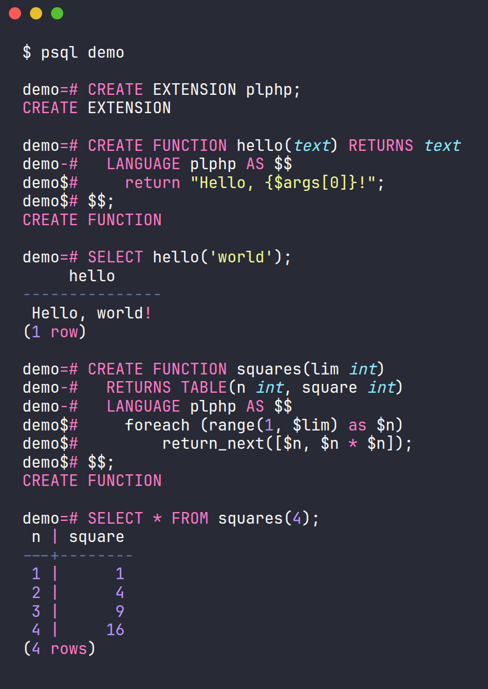

<div align="center">

# PL/php

**Write PostgreSQL functions, triggers, and procedures in PHP.**

[](https://www.postgresql.org/)
[](https://www.php.net/)
[](sql/)
[](#license)

<br>



</div>

PL/php is a procedural-language handler that lets you write database functions in
**PHP**, stored and executed inside PostgreSQL. You get the convenience of PHP's
standard library with the full power of a native PostgreSQL function — plain
functions, set-returning functions, triggers, event triggers, and procedures
with transaction control.

```sql
CREATE EXTENSION plphp;

CREATE FUNCTION hello(text) RETURNS text LANGUAGE plphp AS $$
    return "Hello, {$args[0]}!";
$$;

SELECT hello('world');   -- Hello, world!
```

> [!NOTE]
> **Release 2.0** modernizes PL/php (originally from 2010) for **PostgreSQL 18**
> and the **PHP 8** Zend API, installs as a first-class `CREATE EXTENSION`, and
> adds a large set of PL/Perl- and PL/Tcl-inspired features.

---

## Features

| | |
|---|---|
| 🧩 **Scalars, arrays, composites** | Pass and return ints, text, booleans, multi-dimensional arrays, and composite/record types as native PHP values. |
| 🔁 **Set-returning functions** | `RETURNS SETOF` / `RETURNS TABLE` with `return_next()`. |
| ⚡ **Triggers** | Row & statement triggers via `$_TD` (with `SKIP` / `MODIFY`). |
| 📣 **Event triggers** | Back `CREATE EVENT TRIGGER` with `RETURNS event_trigger`. |
| 🗄️ **Database access (SPI)** | `spi_exec`, `spi_fetch_row`, `spi_processed`, `spi_status`, `spi_rewind`. |
| 📝 **Prepared statements** | `spi_prepare` / `spi_exec_prepared` / `spi_query_prepared` / `spi_freeplan`. |
| 🔐 **Transaction control** | `spi_commit` / `spi_rollback` in procedures, plus `subtransaction()` blocks. |
| 🧰 **Utilities** | `quote_literal` / `quote_nullable` / `quote_ident`, `elog`, `$_SHARED`. |
| 📦 **Session setup** | Anonymous `DO` blocks, `plphp_modules` autoloading, and a `plphp.start_proc` hook. |

See the [**language reference**](doc/plphp.md) for the full API, the
[**cookbook**](doc/cookbook.md) for practical, regression-tested recipes, and
the [PL/Perl](doc/plperl-comparison.md) and [PL/Tcl](doc/pltcl-comparison.md)
comparisons for feature-by-feature detail.

## Examples

**A set-returning function**

```sql
CREATE FUNCTION squares(lim integer)
RETURNS TABLE(n integer, square integer) LANGUAGE plphp AS $$
    for ($n = 1; $n <= $lim; $n++) {
        $square = $n * $n;
        return_next();
    }
$$;

SELECT * FROM squares(3);   -- (1,1), (2,4), (3,9)
```

**Querying the database with a prepared plan**

```sql
CREATE FUNCTION lookup(int) RETURNS text LANGUAGE plphp AS $$
    $plan = spi_prepare('select name from things where id = $1', 'int4');
    $res  = spi_exec_prepared($plan, $args[0]);
    $row  = spi_fetch_row($res);
    spi_freeplan($plan);
    return $row['name'];
$$;
```

**A row trigger that transforms data**

```sql
CREATE FUNCTION uppercase_name() RETURNS trigger LANGUAGE plphp AS $$
    $_TD['new']['name'] = strtoupper($_TD['new']['name']);
    return 'MODIFY';
$$;
```

## Requirements

- **PostgreSQL 11 or newer** (tested on 11–18; 18 recommended), with the server
  development files that provide `pg_config`.
- **PHP 8.x** built with the **embed SAPI** and **without** ZTS (thread safety).
  On Debian/Ubuntu, install `php8.x-dev` and `libphp8.x-embed`.

## Installation

```sh
make
sudo make install
```

Then, in a database:

```sql
CREATE EXTENSION plphp;
```

See [**INSTALL**](INSTALL) for details and troubleshooting, and run the
regression suite with `make installcheck`.

## Security

> [!WARNING]
> **PL/php is an untrusted language.** On modern PHP there is no sandbox
> (`safe_mode` was removed in PHP 5.4), so a PL/php function can do anything the
> PostgreSQL server's operating-system user can — read and write files, open
> network connections, run shell commands, and so on.

The language is created **without** the `TRUSTED` attribute, so only superusers
can install the extension or create PL/php functions. Grant that ability only to
roles you would trust with the server's OS account.

## Documentation

- [Language reference](doc/plphp.md)
- [Cookbook — tested recipes](doc/cookbook.md)
- [Installation](INSTALL)
- [Changelog](CHANGELOG.md)
- [PL/php vs PL/Perl](doc/plperl-comparison.md)
- [PL/php vs PL/Tcl](doc/pltcl-comparison.md)

## License

PL/php is copyright © Command Prompt, Inc. and is distributed under a permissive,
PostgreSQL-style license — see the notice at the top of each source file.
